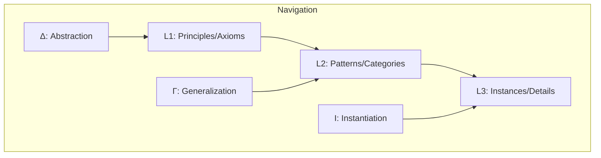

# Progressive Abstraction Layers (Π-System)

## Overview

The Progressive Abstraction Layers system (Π-System) is a highly efficient memory management architecture for AI assistants operating through Cursor. It maximizes information density while minimizing token usage through strategic hierarchical organization.

## Key Features

- **Three-Tiered Memory Hierarchy**: Organizes information from principles to instances
- **Symbolic Compression**: Represents complex ideas with minimal token usage
- **Efficient Navigation**: Access information at the optimal abstraction level
- **RIPER-5 Workflow Integration**: Seamlessly works with structured development workflow

## Memory Architecture

## Getting Started

1. **Installation**: See [Installation Guide](docs/INSTALLATION.md) for setting up the memory system
2. **Usage**: Check [Usage Guide](docs/USAGE.md) for operating the system
3. **Future Development**: View [Future Roadmap](docs/FUTURE.md) for upcoming enhancements

## Benefits

- **Minimal Token Usage**: Store more context within token limitations
- **Rapid Context Rebuilding**: Quickly restore project understanding
- **Improved Knowledge Retention**: Maintain consistent understanding across sessions
- **Structured Knowledge Organization**: Manage complex project information efficiently

## Quick Start

1. Copy the memory template to your project
2. Initialize with your project's core principles
3. Let the system grow and evolve with your project
4. Maintain through regular compression cycles

## License

MIT
